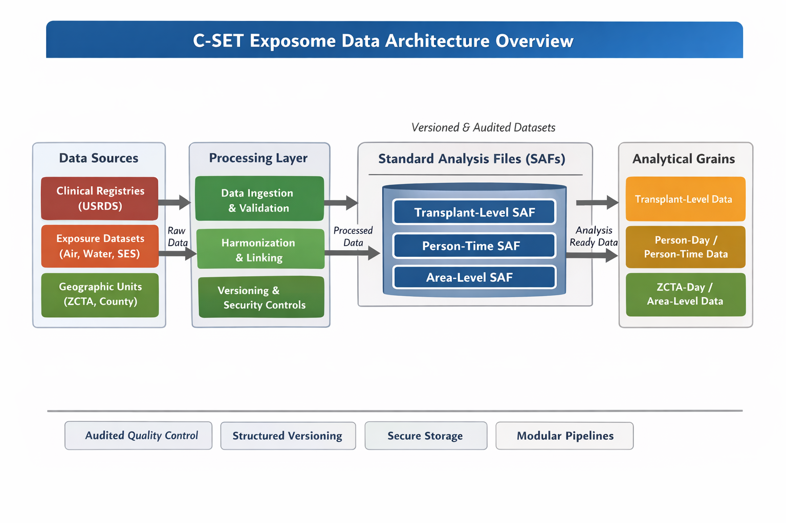

# Data Architecture – C-SET Exposome Infrastructure

### Interpretation

This diagram illustrates the layered architecture of the C-SET exposome infrastructure.

Clinical, environmental, and spatial data sources are first ingested and harmonized within secure environments. These heterogeneous inputs are linked through standardized geographic and temporal keys, enabling construction of multi-granularity Standard Analysis Files (SAFs). 

Downstream statistical and machine learning models operate on SAFs aligned to appropriate analytical grains (e.g., person-day, transplant-level, ZCTA-day), ensuring that modeling strategies are structurally consistent with the underlying data architecture.

The design emphasizes modularity, reproducibility, and explicit version control across all data layers.

## 1. Purpose

This document defines the multi-layer, multi-scale data architecture supporting transplant exposome research at C-SET.

The purpose of this architecture is to integrate heterogeneous clinical, environmental, spatial, and contextual datasets into a unified analytical framework that supports spatiotemporal modeling, causal inference, and high-dimensional risk prediction.

This infrastructure is explicitly designed to:

1. Support multi-granularity analyses across transplant-level, claims-level, person-level, and area-level units.
2. Enable exposure linkage across multiple spatial resolutions (street-level geocoding, 800m–1km grids, ZCTA, county).
3. Align environmental exposures across multiple temporal scales (daily, weekly, monthly, yearly, moving averages, and distributed lag structures).
4. Produce reproducible Standard Analysis Files (SAFs) tailored to specific modeling frameworks.

## 2. High-Level Data Flow

The C-SET exposome data architecture follows a modular, layered workflow:

1. Raw Data Ingestion  
   - Clinical registry, claims, and EHR data are ingested into secure institutional environments.
   - Environmental exposure datasets are obtained from satellite-derived and modeled sources.

2. Data Cleaning and Harmonization  
   - Clinical variables are standardized across sources.
   - Exposure datasets are formatted to consistent spatial and temporal resolutions.

3. Geospatial Linkage  
   - Residential histories are geocoded.
   - Environmental exposures are spatially assigned using grid-, ZCTA-, county-, or address-level linkage.

4. Temporal Alignment  
   - Exposures are aligned to transplant timelines and follow-up windows.
   - Time-varying exposure metrics (e.g., moving averages, lag structures) are constructed.

5. Standard Analysis File (SAF) Construction  
   - Person-time datasets are generated at appropriate analytical grains (e.g., person-day, ZCTA-day).
   - Clinical outcomes and exposure metrics are merged.

6. Modeling and Validation  
   - Statistical and machine learning models are implemented.
   - Diagnostic checks and validation procedures are conducted.

7. Reproducible Output Generation  
   - Summaries, model outputs, and derived metrics are produced in standardized formats.

## 3. Data Layers
### 3.1 Clinical Layer

The clinical layer captures transplant recipient characteristics, longitudinal outcomes, and healthcare utilization across multiple data sources.

Core components include:

- Transplant registry data (e.g., USRDS Core, UNOS components)
- Medicare and other claims data (e.g., CMS Claims)
- Electronic health record (EHR) data (e.g., Epic COSMOS, when available)

Clinical data are structured at multiple analytical grains, including:

- Transplant-level (index transplant characteristics)
- Person-level longitudinal follow-up
- Claims-level healthcare encounters
- Outcome-specific event records (e.g., graft failure, mortality, infection)

Clinical events are encoded using standardized diagnostic and procedural coding systems (e.g., ICD-10), enabling harmonized outcome definitions across datasets.

### 3.2 Environmental Exposure Layer

The environmental exposure layer captures place-based and time-varying environmental conditions linked to transplant recipients.

Core exposure domains include:

- Air pollution metrics (e.g., PM2.5 and related pollutants from modeled or satellite-derived datasets)
- Climate variables (e.g., temperature, heat index, seasonal indicators)
- Climate and vulnerability indices (e.g., Climate Vulnerability Index, neighborhood-level contextual metrics)
- Other modeled environmental surfaces when applicable

Exposures are available across multiple spatial resolutions, including:

- High-resolution gridded surfaces (e.g., 800m–1km grids)
- ZCTA-level aggregates
- County-level aggregates
- Address-level geocoded linkage when permitted

Temporal alignment supports:

- Daily exposure assignment
- Weekly and monthly aggregation
- Moving averages
- Distributed lag structures

This layer enables dynamic exposure-response modeling across acute and chronic windows.

### 3.3 Spatial Linkage Layer

The spatial linkage layer provides the geographic backbone for integrating clinical and environmental data.

Core components include:

- ZCTA boundary files and Gazetteer resources
- ZIP–ZCTA crosswalks
- ZIP–County crosswalks
- County boundary files
- Geocoded residential history records (when available under secure environments)

Spatial linkage is performed using:

- Direct geocoding of residential addresses (when permitted)
- Crosswalk-based mapping across geographic units
- Spatial joins between gridded environmental surfaces and administrative boundaries

This layer ensures consistent spatial harmonization across multi-resolution exposure datasets.

## 4. Linkage Keys and Grain

The C-SET exposome infrastructure relies on standardized linkage keys to integrate multi-layer data sources across space and time.

### Core Identifiers

Primary linkage keys include:

- `patient_id` – Unique individual identifier
- `transplant_id` – Unique transplant episode identifier
- `calendar_date` – Continuous time index used for longitudinal alignment
- `event_date` – Outcome-specific event timestamp (e.g., death, graft failure)
- `ZCTA` – Geographic linkage unit for exposure assignment

### Residential History Structure

A residential history table is used to align individuals to geographic units over time. Typical fields include:

- `patient_id`
- `start_date`
- `end_date`
- `ZIP` and `ZCTA`

ZIP–ZCTA crosswalks are applied when necessary to ensure consistent spatial harmonization.

### Exposure Surface Tables

Environmental exposures are stored in structured surface tables stratified by source and spatial resolution (e.g., 800m grids, 1km grids, ZCTA-level aggregates).

These tables typically include:

- Geographic unit (grid cell, ZCTA, county)
- `calendar_date`
- Exposure metrics (e.g., PM2.5, temperature)
- exposure_build_tag(e.g. PRISM_2025pull, USHAP_2025pull, CVI_2024release)

### Analytical Grain

The infrastructure supports multiple analytical grains, with the most common including:

- Person-day
- ZCTA-day
- Transplant-level

This multi-granularity design enables flexible modeling across longitudinal, spatial, and event-based frameworks.

## 5. Standard Analysis Files (SAFs)

### Naming and Versioning Convention

All Standard Analysis Files (SAFs) follow a structured naming convention to ensure reproducibility across data releases and spatial versions.

Format:

SAF_<grain>_<exposureDomain>_<ZCTAversion>_<USRDSversion>_<buildYear>

Example:

SAF_person_day_pm25_ZCTA2020_USRDS2023_2026build

Version components:

- ZCTAversion: Geographic boundary version (e.g., ZCTA2020)
- USRDSversion: Clinical dataset release year (e.g., USRDS2023)
- buildYear: Year the SAF was generated

## 6. Data Quality and Validation

Data validation procedures are embedded within each modular pipeline to ensure structural integrity, temporal consistency, and spatial accuracy.

Core validation steps include:

### Structural Validation
- Verification of primary keys (patient_id, transplant_id)
- Detection of duplicate records
- Enforcement of unique person-time rows at defined analytical grain

### Temporal Consistency Checks
- Ensuring exposure windows fall within valid residential history periods
- Verifying follow-up windows relative to transplant_date
- Detection of impossible time sequences (e.g., event before transplant)

### Spatial Integrity Checks
- Validation of ZIP–ZCTA mappings
- Completeness of exposure assignment across spatial units
- Missingness diagnostics for geographic linkage

### Exposure Range Checks
- Identification of out-of-range environmental values
- Detection of implausible spikes or discontinuities
- Comparison against source-level summary statistics

### Missingness Monitoring
- Summary tables for missing exposure values
- Missing outcome flag consistency checks

## 7. Security and Compliance

All restricted clinical and geocoded data are stored and processed exclusively within secure, institution-approved computing environments.

Key principles include:

- No identifiable or restricted data are stored in this public repository.
- All data processing occurs within secure HPC or approved storage platforms.
- This repository contains only code, documentation, and structural metadata.
- Data handling complies with institutional review board (IRB) requirements and data use agreements.

Geocoded residential histories and linked exposure datasets are handled under strict access controls.

## 8. Versioning and Reproducibility

Reproducibility is ensured through structured version control at both the code and data levels.

### Code Versioning
- All infrastructure updates are tracked through Git tags and repository releases.
- Major structural changes trigger semantic version updates (e.g., v0.1.0 → v0.2.0).

### Data Versioning
- Clinical datasets are versioned by official release year (e.g., USRDS2023).
- Geographic units are explicitly versioned (e.g., ZCTA2020).
- Exposure datasets include internal build tags documenting source pull year.

### Build Reproducibility
- Standard Analysis Files (SAFs) are regenerated from raw inputs using modular pipelines.
- Each SAF includes metadata describing build date and data versions.
- Analytical outputs are reproducible from versioned SAFs and tagged code releases.

